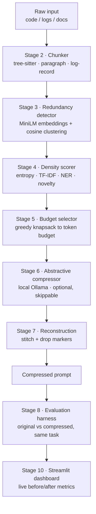

# Ultra-Low Resource LLM Context Compression Engine

An algorithmic token pre-processor that shrinks a large context (source code,
service logs, long documents) by **70%+** before it ever reaches an LLM, while
preserving the reasoning-critical content. Everything runs locally on an
Apple Silicon MacBook - no cloud GPU, no paid API key required.

> **Status: stages 1-5 and 7 complete.** The full compression path -
> chunk, dedup, score, select, reconstruct - runs end to end and is tested
> (182 tests). Stage 6 (abstractive) and 8-11 are next; see
> [Build status](#build-status).

---

## Why this is not just "truncate the middle"

Three properties drive the design, and each maps to a judged metric:

| Property | What it means | Judged metric |
|---|---|---|
| Chunks follow **syntax**, not line windows | a function is one unit; a stack trace is one unit | reasoning retention |
| Redundancy is **collapsed**, not truncated | 2,400 log records → 146 distinct templates | compression ratio |
| Every drop leaves an **audit marker** | the prompt states what was removed and why | reasoning retention |

Nothing in the dashboard is a mockup. Every number is produced by a measured
run and traced back to a `StageMetrics` record.

---

## Architecture



Text form:

```
Raw input (code / logs / docs)
   │
   ▼  Chunker ─────────── tree-sitter (code) · paragraph (text) · record (logs)
   ▼  Redundancy ──────── MiniLM + cosine clustering, collapse to representative + count
   ▼  Density scorer ──── entropy · TF-IDF · spaCy entities · centroid novelty
   ▼  Budget selector ─── greedy: highest density first until the budget is spent
   ▼  Abstractive ─────── local Llama 3.2 3B paraphrase (optional, times out safely)
   ▼  Reconstruction ──── stitch in original order + drop markers
   ▼
Compressed prompt ──► Evaluation harness ──► FastAPI ──► Streamlit dashboard
```

### Repository layout

```
.
├── config.yaml                  # single source of truth: budgets, thresholds, weights, pricing
├── requirements.txt             # pinned
├── pytest.ini
├── engine/
│   ├── config.py                # pydantic-validated config (rejects unknown keys)
│   ├── types.py                 # Chunk, Cluster, StageMetrics - annotated per owning stage
│   ├── tokenizer.py             # tiktoken cl100k_base, flags itself if it degrades
│   ├── embeddings.py            # MiniLM wrapper; offline-first, never raises
│   ├── redundancy.py            # stage 3: exact + structural + embedding passes
│   ├── structural.py            # code token-shape signatures
│   ├── density.py               # stage 4: 5-signal weighted scoring
│   ├── entities.py              # spaCy NER with a regex fallback
│   ├── selector.py              # stage 5: greedy knapsack + dependency repair
│   ├── dependencies.py          # code symbol graph (what references what)
│   ├── reconstruct.py           # stage 7: stitch + audit markers
│   ├── pipeline.py              # stages 2-7 wired together
│   ├── inspect_chunks.py        # CLI: verify chunk quality on any file
│   ├── inspect_redundancy.py    # CLI: audit every collapse decision
│   ├── inspect_density.py       # CLI: per-signal breakdown behind every score
│   └── chunker/
│       ├── base.py              # Chunker ABC + shared size/merge post-processing
│       ├── code.py              # tree-sitter: function/class level
│       ├── text.py              # paragraph/sentence, markdown-aware
│       ├── logs.py              # log records + template extraction
│       └── _spans.py            # span primitives, offset maps, sentence splitting
├── eval/                        # stage 8 - evaluation harness            (pending)
├── backend/                     # stage 9 - FastAPI                       (pending)
├── frontend/                    # React + TS + Tailwind dashboard         (pending)
├── data/sample_corpus/
│   ├── code/auth_service.py     # 240 lines, deliberate near-duplicate validators
│   ├── code/payment_client.js   # exercises the JavaScript grammar
│   ├── docs/incident_postmortem.md
│   ├── support/tickets.txt      # same issue reported in 15 different wordings
│   └── logs/checkout_service.log  # 2,400 records, generated deterministically
├── scripts/
│   ├── setup.sh                 # idempotent environment setup
│   └── make_sample_logs.py      # regenerates the log corpus (fixed seed)
└── tests/                       # 58 tests
```

---

## Setup

Requires Python 3.12 and macOS/Linux. [Ollama](https://ollama.com) is optional.

```bash
git clone <repo> && cd "ultralow resurce context compression engine"
./scripts/setup.sh
```

That creates the virtualenv, installs pinned dependencies, downloads the spaCy
pipeline, generates the sample corpus, and runs the tests.

For stages 6 and 8 you also want a local model (~2 GB):

```bash
ollama pull llama3.2:3b
```

Without it the pipeline **skips** abstractive compression and logs the skip -
it does not crash. That is a hard requirement of the design, not a nicety: a
live demo must never die because a background service is slow.

### Verify the chunker on your own data

```bash
.venv/bin/python -m engine.inspect_chunks <your-file> --verify
```

```
file        : data/sample_corpus/code/auth_service.py
backend     : code:python  (auto-detected: code, requested: auto)
tokenizer   : tiktoken:cl100k_base
source      : 8,515 chars, 1,952 tokens, 240 lines
chunks      : 24  (class=5, class_header=1, function=10, method=6, module_level=2)
tokens/chunk: min=14 p50=77 max=233 total=1,943 (coverage 99.5%)

   #  kind                lines    tok  symbol                       preview
   0  module_level         1-22    124                               """Authentication service for the Northwind…
   7  function            57-66     94  _signing_key                 def _signing_key() -> bytes: """Return the…
  16  method            136-158    233  TokenService.issue           def issue(self, subject: str, tenant_id: …

VERIFY OK - chunks tile the source with no gaps, overlaps or text drift
```

Useful flags: `--kind code|text|log` forces a backend, `--show N` prints one
chunk in full, `--json` emits machine-readable output, `--verify` asserts the
lossless-tiling invariant.

---

### Audit what stage 3 collapsed

```bash
.venv/bin/python -m engine.inspect_redundancy <your-file> --show-members
```

Every collapse is listed with the method that caused it and its similarity
score, so a compression claim can be checked line by line.

Measured on the sample corpus (stage 3 alone, before any density-based
selection):

| Input | Chunks | Tokens | Reduction | Pass that fired |
|---|---|---|---|---|
| `checkout_service.log` | 2,400 → 146 | 107,200 → 6,560 | **93.9%** | exact / template |
| `tickets.txt` | 26 → 22 | 1,316 → 1,110 | 15.7% | embedding |
| `auth_service.py` | 24 → 22 | 1,945 → 1,776 | 8.7% | structural |
| `payment_client.js` | 11 → 11 | 715 → 715 | 0% | none - no duplicates |
| `incident_postmortem.md` | 16 → 16 | 1,401 → 1,401 | 0% | none - no duplicates |

The two zeros are real and are left in deliberately: those files genuinely
contain no redundancy, and a redundancy detector that "found" some would be
broken. Their compression comes from stages 4-5 instead.

### Inspect why a chunk scored what it scored

```bash
.venv/bin/python -m engine.inspect_density <your-file> --grep "pool wait"
```

Prints the per-signal breakdown behind every rank. `--grep` reports where
specific content lands, which is how the weights below were calibrated.

After stages 2→3→4 on `checkout_service.log`, the ranking is:

| Rank | Chunk |
|---|---|
| 1 | `WARN config value PAYMENT_POOL_SIZE resolved to 8` — the root cause |
| 8 | `ERROR unhandled exception in charge path` + full traceback |
| 10–16 | `ERROR gateway timeout after 8000ms` |
| 12 | `WARN connection pool wait exceeded threshold` |
| 14 | `INFO rollback initiated` — the fix |
| …143–146 | `DEBUG emitted metric checkout.latency` — routine telemetry |

---

## Design notes

**The tiling invariant.** Chunks must cover the source in order, with no gaps,
no overlaps, and text identical to its recorded character span. It is asserted
by `--verify` and by a test over every sample file. If the chunker silently
dropped text, every downstream compression number would be inflated by that
loss - so this is checked, not assumed.

**Token counts are real.** All ratios are token ratios from `tiktoken`
`cl100k_base`, not character counts. If tiktoken cannot load (offline first
run), the tokenizer falls back to a word-based estimate and sets
`is_exact = False`, which propagates into every report. An estimate is never
presented as a measurement.

**Log templates are deliberately conservative.** Volatile fields (timestamps,
UUIDs, order ids, durations) are normalised so that near-identical records
collapse - 2,400 records reduce to 146 distinct templates, 93.9% collapsible
before a single embedding is computed. But `/v1/checkout`, `eu-west-1` and
`v2.31.0` are left intact: over-collapsing merges events a judge can
legitimately ask us to tell apart, and costs reasoning retention. Under-
collapsing only costs a little compression ratio.

**Headings attach forwards.** A `## Root Cause` heading merges into the section
it introduces, never the one above it. Getting this backwards silently files
content under the wrong section heading.

**Three dedup passes, cheapest first, each for a different input type.** They
are not redundant with each other:

- *Exact* keys on a hash, or on the log template stage 2 extracted. Collapses
  93.9% of the sample log for the cost of a dict lookup, and needs no model -
  it is the floor the pipeline degrades to when embeddings are unavailable.
- *Structural* keys on a code chunk's token shape, with identifiers and strings
  blanked but **numbers preserved**. MiniLM is trained on prose and scores four
  near-identical validators at only 0.62-0.77 cosine, so embeddings alone do
  nothing for source files. Preserving numbers is what lets a 64-character
  limit collapse with another 64 while `validate_password`'s 128 survives on
  its own.
- *Embedding* catches text that shares no phrasing to hash - fifteen support
  tickets describing one outage in fifteen different wordings. Only this pass
  can do that, and only prose needs it.

**A precise key always beats a fuzzy one.** Chunks that already have an exact
dedup key (log templates) are *exempt* from embedding clustering. Fuzzy matching
scores `cart-store [ap-south-1] cache hit` against `inventory [eu-west-1] cache
hit` at 0.998 and merged them - collapsing four services and three regions into
one representative, silently undoing the retention decision stage 2 made when it
kept service and region out of the placeholder set. Fuzzy matching can only
destroy distinctions a precise key has captured, never add any. Enforcing that
cost 3.8 points of compression ratio on the log file (97.7% → 93.9%) and is
worth it.

**The similarity threshold is set from a sweep, not a guess.** On the support
tickets, every merge at the 0.88 default is within-category; by 0.74 a
duplicate-charge complaint merges into a damaged-item refund request. The
default sits well inside the safe zone, and `test_distinct_customer_issues_
survive_at_the_default_threshold` locks it there.

**Density weights were calibrated against known-critical content, not guessed.**
The first configuration (entropy/tfidf/entities 0.25 each, structure 0.10,
frequency 0.15) ranked routine INFO cache-hit lines in the top four while the
stack trace fell to 90/146 and the root-cause WARN to 78/146. Three causes, all
visible in `inspect_density`'s per-signal columns:

- *Lexical signals were reading volatile fields.* `order=ORD-427039
  user=usr_1234 status=200` makes routine traffic look maximally
  information-dense - every id is a unique term, so TF-IDF calls it rare, and
  reads as a number, so the entity counter calls it a fact. Those are exactly
  the fields stage 2 identified as volatile. Lexical signals now score the log
  *template* with placeholders stripped, i.e. what the line actually says.
- *The frequency bonus was ranking on noise.* At 0.15 an INFO line seen 34
  times scored 0.97 on that signal alone. Cut to 0.05: worth acknowledging that
  a representative stands in for 400 events, not worth ranking on.
- *Severity was underweighted.* Rarity and severity predict "this answers a
  question about the incident"; raw entity counts do not.

**Novelty is distance from the corpus centroid, not the cluster centroid.** A
deliberate deviation from the brief: distance-from-*cluster*-centroid is zero
for every singleton cluster, scoring every unique chunk as maximally un-novel -
backwards, since a one-off `ERROR` is the most novel thing in a log file.

**Short chunks do not get free entropy.** Normalised entropy pins to 1.0 when
almost every token is distinct, which happens by construction in 14 tokens. That
ranked a `class AuthError(Exception)` stub above the entire authentication flow.
The estimate is now damped by `log2(n)/log2(64)`.

**Every score is explainable.** `chunk.density_parts` carries the per-signal
contribution behind each rank, and when a signal is unavailable - no embeddings,
no scikit-learn - its weight is redistributed over the rest and the stage says
so, rather than silently scoring it zero.

**Collapsing is only acceptable because the loss is recorded.** A cluster's
representative keeps its complete original text; absorbed members survive as a
count plus their symbols, which stage 7 renders as an audit marker. "400
identical cache-hit lines" becomes one line and a `x400` annotation - the *fact*
of the repetition is preserved, only the redundant bytes are gone. An accounting
invariant asserts that every removed token is attributed to exactly one cluster,
so the drop markers can never quietly under-report what was removed.

**Everything is config-driven.** Token budget, similarity thresholds, scoring
weights and per-token pricing all live in `config.yaml`. Unknown keys raise a
validation error rather than being silently ignored.

**Vector store.** ChromaDB is not used. Compression operates on one document at
a time and holds a few thousand embeddings in memory; a persistent vector store
would add a dependency and a failure mode for no benefit. This is a deliberate
deviation from the original stack list.

---

## Build status

| Stage | Component | Status |
|---|---|---|
| 1 | Scaffold, config, tokenizer | done |
| 2 | Chunker (code / text / log) | done |
| 3 | Redundancy detector | done |
| 4 | Density scorer | done |
| 5 | Budget-constrained selector | done |
| 6 | Abstractive compressor (Ollama) | pending |
| 7 | Reconstruction + drop markers | done |
| 8 | Evaluation harness | pending |
| 9 | FastAPI backend | pending |
| 10 | React dashboard | pending |
| 11 | Deployment + `run.sh` | pending |

## Tests

```bash
.venv/bin/python -m pytest
```

125 tests covering the tiling invariant on every backend, code/text/log chunk
semantics, graceful degradation (unparsable source, missing grammar, missing
tiktoken, dead embedding backend, missing spaCy), unicode offset handling,
config validation, cluster accounting, and the retention properties above -
that distinct customer issues never merge, that a differing numeric limit blocks
a structural collapse, that no service or region is lost to fuzzy clustering,
and that every piece of incident-critical content ranks in the top decile.

The ranking tests are the load-bearing ones. A density score that is
well-formed but sorts routine DEBUG noise above a stack trace is worthless, and
only an assertion about *what ends up on top* catches that.
