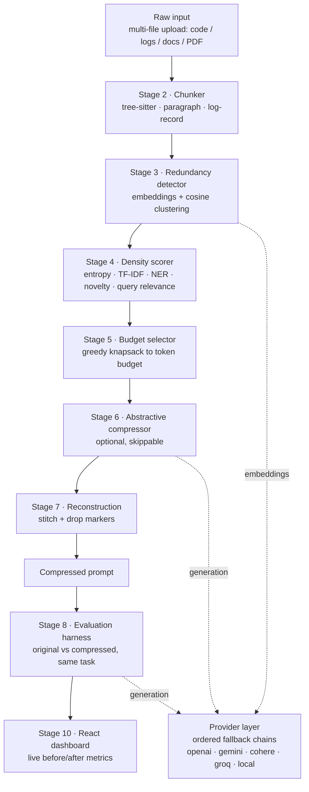

# Ultra-Low Resource LLM Context Compression Engine

An algorithmic token pre-processor that shrinks a large context (source code,
service logs, long documents) by **70%+** before it ever reaches an LLM, while
preserving the reasoning-critical content.

The compression itself is pure algorithm - chunking, clustering, scoring,
selection - and calls no model at all. The two places that *do* need a model
(embeddings for redundancy detection, and optional paraphrasing) go through a
**multi-provider layer with an ordered fallback chain**: OpenAI, Google Gemini,
Cohere and Groq for hosted inference, plus fully local MiniLM and Ollama at the
end of every chain. A provider with no key configured is skipped; one that is
rate-limited or down is passed over and the next one serves. The system has no
single provider it cannot lose.

> **Status: stages 1-10 complete.** Pipeline, provider layer, evaluation
> harness, FastAPI backend and React dashboard all run end to end and are
> tested. See [Build status](#build-status).

---

## Why this is not just "truncate the middle"

Three properties drive the design, and each maps to a judged metric:

| Property | What it means | Judged metric |
|---|---|---|
| Chunks follow **syntax**, not line windows | a function is one unit; a stack trace is one unit | reasoning retention |
| Redundancy is **collapsed**, not truncated | 2,400 log records → 146 distinct templates | compression ratio |
| Every drop leaves an **audit marker** | the prompt states what was removed and why | reasoning retention |

Nothing in the dashboard is a mockup. Every number is produced by a measured
run and traced back to a `StageMetrics` record.

---

## Architecture



Text form:

```
Raw input (multi-file: code / logs / docs / PDF)
   │
   ▼  Ingestion ────────── N files → one context, upload order, provenance kept
   ▼  Chunker ─────────── tree-sitter (code) · paragraph (text) · record (logs)
   ▼  Redundancy ──────── embeddings + cosine clustering, collapse to representative + count
   ▼  Density scorer ──── entropy · TF-IDF · entities · novelty · query relevance
   ▼  Budget selector ─── greedy: highest density first until the budget is spent
   ▼  Abstractive ─────── LLM paraphrase (optional, safety-checked, times out safely)
   ▼  Reconstruction ──── stitch in original order + drop markers
   ▼
Compressed prompt ──► Evaluation harness ──► FastAPI ──► React dashboard

Stages 3, 6 and 8 are the only ones that call a model. All three go through
one provider layer:

   embeddings  : openai → gemini → cohere → local        (config.yaml)
   generation  : groq → gemini → openai → local          (config.yaml)
```

### Repository layout

```
.
├── config.yaml                  # single source of truth: budgets, thresholds, weights, pricing
├── requirements.txt             # pinned
├── pytest.ini
├── .env.example                 # every supported API key, where to get it, all optional
├── engine/
│   ├── config.py                # pydantic-validated config (rejects unknown keys)
│   ├── types.py                 # Chunk, Cluster, StageMetrics - annotated per owning stage
│   ├── tokenizer.py             # tiktoken cl100k_base, flags itself if it degrades
│   ├── providers/               # THE model layer - every model call goes through here
│   │   ├── base.py              # EmbeddingProvider / GenerationProvider contracts
│   │   ├── embedding.py         # openai · gemini · cohere · local MiniLM
│   │   ├── generation.py        # groq · gemini · openrouter · openai · local Ollama
│   │   ├── chain.py             # ordered fallback, skip-on-no-key, cooldown
│   │   ├── keys.py              # env-only key access + redaction
│   │   ├── _http.py             # one place that knows how to fail informatively
│   │   └── check.py             # CLI: hit every configured provider for real
│   ├── ingestion.py             # multi-file upload → one context (incl. PDF)
│   ├── embeddings.py            # stage 3's adapter over the embedding chain
│   ├── redundancy.py            # stage 3: exact + structural + embedding passes
│   ├── structural.py            # code token-shape signatures
│   ├── density.py               # stage 4: 6-signal weighted scoring (incl. query relevance)
│   ├── entities.py              # spaCy NER with a regex fallback
│   ├── selector.py              # stage 5: greedy knapsack + dependency repair
│   ├── dependencies.py          # code symbol graph (what references what)
│   ├── reconstruct.py           # stage 7: stitch + audit markers
│   ├── pipeline.py              # stages 2-7 wired together
│   ├── inspect_chunks.py        # CLI: verify chunk quality on any file
│   ├── inspect_redundancy.py    # CLI: audit every collapse decision
│   ├── inspect_density.py       # CLI: per-signal breakdown behind every score
│   ├── confidence.py            # measured trust score for one compression
│   └── chunker/
│       ├── base.py              # Chunker ABC + shared size/merge post-processing
│       ├── code.py              # tree-sitter: function/class level
│       ├── text.py              # paragraph/sentence, markdown-aware
│       ├── logs.py              # log records + template extraction
│       └── _spans.py            # span primitives, offset maps, sentence splitting
├── eval/
│   ├── harness.py               # stage 8 - runs original vs compressed, writes reports/
│   ├── testset.py               # loads + validates the 15-item test set
│   └── scoring.py               # deterministic key-fact recall (+ optional judge)
├── backend/main.py              # stage 9 - FastAPI: /compress /expand /providers /health
├── run.sh                       # one-command local run
├── docs/API_CONTRACT.md         # the frontend contract
├── frontend/                    # React + TS + Tailwind dashboard
│                                #   multi-file drop zone, model dropdown,
│                                #   query box, expandable markers
├── data/sample_corpus/
│   ├── code/auth_service.py     # 240 lines, deliberate near-duplicate validators
│   ├── code/payment_client.js   # exercises the JavaScript grammar
│   ├── docs/incident_postmortem.md
│   ├── support/tickets.txt      # same issue reported in 15 different wordings
│   └── logs/checkout_service.log  # 2,400 records, generated deterministically
├── scripts/
│   ├── setup.sh                 # idempotent environment setup
│   └── make_sample_logs.py      # regenerates the log corpus (fixed seed)
└── tests/                       # 380 unit + 20 opt-in integration tests
```

---

## Setup

Requires Python 3.12 and macOS/Linux.

```bash
git clone <repo> && cd "ultralow resurce context compression engine"
./scripts/setup.sh
```

That creates the virtualenv, installs pinned dependencies, downloads the spaCy
pipeline, generates the sample corpus, and runs the tests.

### API keys

```bash
cp .env.example .env      # then fill in whichever you have
```

**Every key is optional.** A provider whose key is missing is skipped in the
fallback chain, not an error. Four of the five have a free tier:

| Key | Provider | Role | Tier | Get one |
|---|---|---|---|---|
| `GROQ_API_KEY` | Groq | generation | **free** | <https://console.groq.com/keys> |
| `GOOGLE_API_KEY` | Gemini | embeddings **and** generation | **free** | <https://aistudio.google.com/apikey> |
| `COHERE_API_KEY` | Cohere | embeddings | **free** trial | <https://dashboard.cohere.com/api-keys> |
| `OPENROUTER_API_KEY` | OpenRouter | generation (`:free` models) | **free** | <https://openrouter.ai/keys> |
| `OPENAI_API_KEY` | OpenAI | embeddings **and** generation | paid | <https://platform.openai.com/api-keys> |

One free Google key alone covers both roles. Keys are read from the environment
only, are never logged, and are never included in any API response or error
message — `/health` reports each one as a boolean and nothing more.

### Running with no keys at all

The engine still works end to end on its local providers:

```bash
ollama pull llama3.2:3b      # ~2 GB, backs the tail of the generation chain
export CCE_OFFLINE=1         # optional: forces local-only, makes no network calls
```

MiniLM (embeddings) and Ollama (generation) are the last entry in their
respective chains, so a machine with no keys and no network degrades to them
rather than failing. Without Ollama the pipeline **skips** abstractive
compression and logs the skip — it does not crash. That is a hard requirement
of the design, not a nicety: a live demo must never die because one provider is
having a bad afternoon.

### Check what is actually live

```bash
.venv/bin/python -m engine.providers.check --chains
```

Hits every configured provider with the smallest real request it supports and
prints what came back, then resolves both chains and shows which entry served.
Providers without a key report `skip`, which is the correct state, not a
failure. The same information is on `GET /health` and in the dashboard's
provider bar.

### Verify the chunker on your own data

```bash
.venv/bin/python -m engine.inspect_chunks <your-file> --verify
```

```
file        : data/sample_corpus/code/auth_service.py
backend     : code:python  (auto-detected: code, requested: auto)
tokenizer   : tiktoken:cl100k_base
source      : 8,515 chars, 1,952 tokens, 240 lines
chunks      : 24  (class=5, class_header=1, function=10, method=6, module_level=2)
tokens/chunk: min=14 p50=77 max=233 total=1,943 (coverage 99.5%)

   #  kind                lines    tok  symbol                       preview
   0  module_level         1-22    124                               """Authentication service for the Northwind…
   7  function            57-66     94  _signing_key                 def _signing_key() -> bytes: """Return the…
  16  method            136-158    233  TokenService.issue           def issue(self, subject: str, tenant_id: …

VERIFY OK - chunks tile the source with no gaps, overlaps or text drift
```

Useful flags: `--kind code|text|log` forces a backend, `--show N` prints one
chunk in full, `--json` emits machine-readable output, `--verify` asserts the
lossless-tiling invariant.

---

### Audit what stage 3 collapsed

```bash
.venv/bin/python -m engine.inspect_redundancy <your-file> --show-members
```

Every collapse is listed with the method that caused it and its similarity
score, so a compression claim can be checked line by line.

Measured on the sample corpus (stage 3 alone, before any density-based
selection):

| Input | Chunks | Tokens | Reduction | Pass that fired |
|---|---|---|---|---|
| `checkout_service.log` | 2,400 → 146 | 107,200 → 6,560 | **93.9%** | exact / template |
| `tickets.txt` | 26 → 22 | 1,316 → 1,110 | 15.7% | embedding |
| `auth_service.py` | 24 → 22 | 1,945 → 1,776 | 8.7% | structural |
| `payment_client.js` | 11 → 11 | 715 → 715 | 0% | none - no duplicates |
| `incident_postmortem.md` | 16 → 16 | 1,401 → 1,401 | 0% | none - no duplicates |

The two zeros are real and are left in deliberately: those files genuinely
contain no redundancy, and a redundancy detector that "found" some would be
broken. Their compression comes from stages 4-5 instead.

### Inspect why a chunk scored what it scored

```bash
.venv/bin/python -m engine.inspect_density <your-file> --grep "pool wait"
```

Prints the per-signal breakdown behind every rank. `--grep` reports where
specific content lands, which is how the weights below were calibrated.

After stages 2→3→4 on `checkout_service.log`, the ranking is:

| Rank | Chunk |
|---|---|
| 1 | `WARN config value PAYMENT_POOL_SIZE resolved to 8` — the root cause |
| 8 | `ERROR unhandled exception in charge path` + full traceback |
| 10–16 | `ERROR gateway timeout after 8000ms` |
| 12 | `WARN connection pool wait exceeded threshold` |
| 14 | `INFO rollback initiated` — the fix |
| …143–146 | `DEBUG emitted metric checkout.latency` — routine telemetry |

---

## Measured results

Produced by `python -m eval.harness` on a 15-item question-answering set at
`budget_ratio` 0.30, on an M2. Regenerate with the same command; the report
lands in `reports/latest.json` and `.csv`, and records which provider served it.

**Which provider produced these numbers.** The run below resolved to
`local:llama3.2:3b`. The configured generation chain is
`groq → gemini → openai → local`; on the machine that produced this report Groq
and Gemini had no key configured and the OpenAI key returned
`429 insufficient_quota`, so the chain fell through to the local provider — the
report's `config.generation_attempts` block records exactly that, per provider.
**These are therefore not hosted-inference numbers.** With a Groq or Gemini key
present the chain serves from there instead and the latency figures below will
change substantially; the compression figures will not, for the reason in the
next paragraph.

| Judged metric | Result | Target |
|---|---|---|
| Compression ratio | **71.5%** (88,664 → 25,317 tokens) | 70% ✅ |
| Cost reduction | **70.9%** ($0.01361 → $0.00396) | ✅ |
| Latency speedup | **3.76×** (514.0s → 136.9s) | ✅ |
| Accuracy retention | **63.0%** (90.0% → 56.7%) | 95% ❌ |
| Fact survival | **80.8%** (21/26 key facts) | — |

### What the provider migration did and did not move

Re-measured after the migration, against the pre-migration local-only report:

| Metric | Before (local-only) | After (provider layer) | Δ |
|---|---|---|---|
| Compression ratio | 0.7145 | 0.7145 | **0** |
| Tokens before → after | 88,664 → 25,317 | 88,664 → 25,317 | **0** |
| Cost reduction | 0.7092 | 0.7092 | **0** |
| Accuracy retention | 0.6296 | 0.6296 | **0** |
| Fact survival | 0.8077 | 0.8077 | **0** |
| Latency speedup | 4.05× | 3.76× | −0.30 |
| Wall clock | 842.9 s | 1013.9 s | +171 s |

Every compression-side number is **bit-for-bit identical**, which is the result
a clean swap behind an interface should produce: the chunking, clustering,
density and selection algorithms were not touched, and the chain resolved to
the same model that produced the original figures. Only the two wall-clock
numbers moved, and they moved for mundane reasons — background load on the same
laptop, plus one wasted OpenAI round-trip per cooldown window while the chain
discovered the dead key each minute. Neither is a property of the compressor.

The honest summary: **this run demonstrates that the migration preserved the
pipeline, not that hosted inference improves it.** The latter needs a working
hosted key and has not been measured here.

Cost uses published gpt-4o-mini per-token pricing from `config.yaml` applied to
measured token counts — it answers "what would this prompt cost against a
hosted API", which is the number that transfers off this laptop. Latency is
wall-clock for whichever provider served the run, and is now partly a property
of the network, so it is the least transferable figure on this page.

### Why retention is 63% and not 95%

The number decomposes, and the two halves have different owners:

| | Measured |
|---|---|
| Key facts surviving compression | **80.8%** — the compressor's own ceiling |
| Facts the model retrieved from the compressed context | 56.7% |
| Facts the model retrieved from the **full original** | 90.0% — imperfect either way |

Of the 5 degraded items, **4 had the required fact verifiably present in the
compressed text and the model still answered "NOT FOUND."** For `log-02`, both
`ReadTimeout` and `payments.internal` are in the compressed context. So the
dominant remaining gap is small-model *retrieval*, not information destroyed by
compression.

One hypothesis was tested and rejected: that the `[... omitted ...]` markers
were priming the model toward NOT FOUND. Re-running the failures with markers
disabled changed nothing (12% both ways).

### Compression and retention trade off by input type

Fact survival through compression, measured without any model calls:

| Budget | Overall | Logs | Postmortem | Code | Tickets |
|---|---|---|---|---|---|
| 15% | 61.5% | 8/8 | 3/8 | 2/7 | 1/3 |
| 30% | **80.8%** | **8/8** | 5/8 | 6/7 | 2/3 |
| 50% | 84.6% | 8/8 | 5/8 | 7/7 | 2/3 |

Redundant input compresses essentially for free — the 107k-token log holds
**8/8 facts at every budget including 15%**. Fact-dense prose with no
redundancy has a real ceiling: there is no way to remove 70% of a document
where every paragraph states different facts and keep them all. That is a
property of the input, not a defect in the compressor, and the harness
quantifies it rather than averaging it away.

### Stage 6 (abstractive) is built, safe, and switched off in practice

Re-measured after the provider migration. The original finding was "stage 6
earns nothing on this corpus"; re-running it through the provider layer made the
*reason* sharper than it had been. The left column is what stage 6 sees in the
pipeline; the right is the same stage run over the full chunk set with selection
bypassed, which isolates the mechanism from the ordering:

| File | Post-selection (what stage 6 actually sees) | Ignoring selection (all chunks) |
|---|---|---|
| `incident_postmortem.md` | 0 eligible chunks → **0 tokens saved** | 3 eligible, 1 accepted, **77 tokens saved**, 1 correctly rejected (`numbers_lost`) |
| `auth_service.py` | 0 eligible chunks → **0 tokens saved** | 3 eligible, 1 accepted, **14 tokens saved** |
| `tickets.txt` | 0 eligible chunks → **0 tokens saved** | 0 eligible (no chunk reaches 150 tokens) |

The mechanism works: run on the full chunk set it saves 91 tokens and its
safety check correctly discards a paraphrase that dropped a number. But **after
stage 5 there are zero chunks above the 150-token threshold on any of the three
files.** The stage does not try and fail — it has nothing to try.

That reframes the conclusion in a way that matters for this migration:

> **This is a selection-order property, not a model-quality property.** No
> model, however strong, can compress zero chunks. Swapping llama3.2:3b for
> gpt-4o-mini or llama-3.3-70b changes the acceptance rate on the chunks stage 6
> *is* given; it cannot change the fact that stage 5 has already dropped every
> chunk large enough to qualify.

So at the shipped budget a stronger provider **cannot** rescue stage 6, and that
part of the finding is provider-independent — it holds regardless of which chain
entry serves.

### …but at a permissive budget, a stronger model does earn something

Once Groq was live the follow-up became measurable, and it revises the
second half of the conclusion. At `budget_ratio: 0.95`, where
150-token chunks *do* survive selection:

| Provider | Paraphrases accepted | Wall clock |
|---|---|---|
| `local` llama3.2:3b | **0** | 13.4 s |
| `groq` llama-3.3-70b | **2** | 6.4 s |

**This is a new, positive finding and it is reported as one.** The 70B model
produces paraphrases that pass the entity-overlap and number-retention checks
where the 3B model's are all rejected. The safety net did not change; the
quality of what reaches it did.

It does not rescue the default configuration — at `budget_ratio: 0.30` there are
still zero eligible chunks, and no model can compress zero chunks. But the
earlier phrasing ("a stronger model cannot help") was too broad: it is true of
the *selection ordering*, not of the mechanism. Reproduce either result with the
model dropdown and the budget slider.

`fast_mode: true` remains the recommended live path: identical output, without
paying 3–6 s per chunk to discover there is nothing to do.

---

## Query-aware selection

Pass a question and the selector keeps what answers **that question**, not
merely what is generally informative. Without it the engine is query-blind: a
100k-token log compresses identically whether you asked about pool size or
rollback timing.

It is a sixth density signal — cosine similarity between each chunk and the
question, using the embeddings stage 3 already computed. When no question is
supplied the signal is marked unavailable and its weight is redistributed, so a
query-less compression scores **bit-identically** to before the signal existed.

Measured on the benchmark corpus, local embeddings, budget 0.30:

| Key-fact survival | Query-blind | Query-aware | Δ |
|---|---|---|---|
| **Overall** | 80.8% (21/26) | **96.2%** (25/26) | **+15.4** |
| postmortem | 62.5% | **100%** | +37.5 |
| auth_code | 85.7% | **100%** | +14.3 |
| log_incident | 100% | 100% | — |
| tickets | 66.7% | 66.7% | — |

Reproduce the control with `python -m eval.harness --no-query`.

This is the compressor's **ceiling** — downstream accuracy is bounded by it — so
raising it from 80.8% to 96.2% raises the ceiling on everything downstream. It
directly addresses the finding that 4 of 9 missed facts had been dropped by the
selector rather than missed by the model.

**One hazard worth naming.** The query is embedded in a second chain call, so
it can land on a different provider than the chunks did if the first entered
cooldown in between — a 3072-d Gemini query dotted against 1024-d Cohere chunks
is not a weak signal, it is a crash. The pipeline compares both the serving
provider and the dimension, and drops the signal rather than mixing two vector
spaces — see `test_a_mismatched_query_dimension_is_dropped_not_crashed`.

### Cloud embeddings also lift the ceiling, separately

Independently of the query signal, swapping local MiniLM (384-d) for a cloud
embedder changes what stage 3 clusters:

| Embeddings | Fact survival @0.30, query-blind |
|---|---|
| local MiniLM (384-d) | 80.8% (21/26) |
| cloud (Cohere `embed-english-v3.0`, 1024-d) | **84.6%** (22/26) |

Reported separately from the query-aware gain on purpose — they are different
mechanisms. **Whether they compose has not been measured**: the combined run
exhausted Cohere's and Gemini's free-tier rate limits partway through and fell
back to exact-hash dedup, which is a degraded run, not a cloud one. One extra
fact out of 26 is also a single-item difference on a 15-item set — worth far
less than the query-aware gain, and not worth over-reading.

---

## Compared against LLMLingua-2

Truncation and random sampling are strawmen; nobody ships them. **LLMLingua is
the actual prior art**, so it is measured here on the same corpus, same budgets
and the same key-fact metric:

```bash
python -m eval.harness --compare-baselines --with-llmlingua
```

Key-fact survival, all four compressors, same corpus and same metric
(`reports/baseline_comparison.json`):

| Budget | naive truncation | random | **this engine** | LLMLingua-2 |
|---|---|---|---|---|
| 0.15 | 50.0% | 15.4% | **53.8%** | 19.2% |
| **0.30** | 73.1% | 50.0% | **80.8%** | 53.8% |
| 0.50 | 88.5% | 69.2% | **92.3%** | 69.2% |

LLMLingua-2 also missed its budget in both directions — asked for 0.15 it
returned 0.16 of the tokens, asked for 0.50 it returned 0.64:

| Budget asked | LLMLingua-2 tokens | actual ratio |
|---|---|---|
| 0.15 | 19,193 → 3,054 | 0.84 removed |
| 0.30 | 19,193 → 7,068 | 0.63 removed |
| 0.50 | 19,193 → 12,353 | 0.36 removed |

It is fast: ~8 s for the whole corpus on CPU, comparable to ours.

**Provenance caveat.** Our rows here came from the default provider chain, so
stage 3 used whichever embedder was live at the time. Embedding choice moves
these numbers by a few points on its own (see the table above), so the honest
reading is "this engine, default chain" rather than a single fixed
configuration. Re-running can shift our column by ±1-2 facts out of 26.

**Why the gap, honestly.** LLMLingua-2 is a token-level classifier: it drops
individual tokens, so `8.4s` comes back as `8. 4 s` and `INC-4471` as
`INC - 4471`. Our metric is exact fact matching, which that fails. Two things
follow, and both should be said:

- The gap is **real for auditability and exactness** — if you need the compressed
  prompt to still contain `PAYMENT_POOL_SIZE` verbatim, or to still be valid
  code, token-level filtering cannot give you that. Nor can it tell you what it
  removed; there is no marker to expand.
- The gap would be **smaller on "can an LLM still answer"**, which is what
  LLMLingua optimises for. A model may well read `8. 4 s` as `8.4s`. Measuring
  that needs a downstream-model comparison, which has **not** been run here —
  so this table is a claim about fact preservation, not about answer quality.

---

## Recovering what was compressed away

Every marker carries an id, and every id is an address:

```
[... omitted #d3 4 section(s), 187 tokens, lines 22-41 ...]
[x172 #c0 near-identical occurrences collapsed (6752 tokens saved, exact match)]
```

```bash
curl localhost:8000/expand/<compression_id>/d3
```

...returns exactly those 4 sections. The dashboard renders each marker as a
click-to-recover row.

This is the property no truncation- or perplexity-based compressor has: the
compression is a **lossy view over retained content**, not destruction. An agent
that reads `#d3`, decides it needs that material, and asks for it back does not
have to re-run the whole compression at a looser budget and hope.

The recovered text is held server-side (bounded to the last 8 compressions)
rather than inlined in the response — it is by definition the bulk of what
compression just removed, and returning it would undo the payload saving the
`spans[]` design exists for.

---

## Choosing the model

The dashboard has **one dropdown** listing every model, and the backend
resolves each choice into a coherent pair of providers — a compression uses two
models (one to embed, one to rewrite) and no vendor supplies both for every
choice: Groq has no embeddings API, Cohere has no chat API. The entry names the
model you are choosing and the line beneath it discloses the embedder it
resolved to. `GET /providers` drives the list, so a model added to
`config.yaml` appears with no frontend change.

Underneath, every `/compress` and `/evaluate` request takes a `mode`, plus
optional `embedding_provider` / `generation_provider` pins:

| Mode | Behaviour |
|---|---|
| `local` | Local providers only. **Makes no outbound API call**, even with every key configured. |
| `cloud` | Configured cloud chain only. **Never silently degrades to local** — an exhausted chain returns `503`. |
| `auto` | Cloud first, local last. Default, and the pre-existing behaviour. |

**`local` making no network call is a guarantee, not an intention.** The test
severs `requests` at the transport layer so every outbound call raises, then
runs a full compression with all five keys set and asserts it still succeeds.
"It returned local-looking results" would not be evidence — a provider could
have been called and merely lost a race. The only proof is that a call was
impossible.

**`cloud` refuses to fall back to local** because a user who asked for cloud and
silently received a 3B local model would read its latency and accuracy as
cloud's, and conclude the opposite of the truth. A loud error is the honest
answer.

Both model-calling stages resolve under the same mode within one request —
embedding in the cloud while generating locally would report numbers describing
a configuration nobody chose. `summary.providers_used` and each stage's
`provider_used` name the provider that actually **answered**, so a fallback is
visible rather than implied.

**A pinned provider gets no fallback either**, for the same reason: comparing
Groq against Gemini while silently receiving Gemini for both would make them
look identical. Only the `Auto` entry keeps a chain.

`/health` reports the two modes' readiness **independently**, which is what lets
the dropdown disable an entry instead of letting someone pick one that fails:
Ollama being down must not make cloud look broken, and having no keys must not
make local look broken.

### The live demo

Same input, one click apart, measured on this machine (postmortem, budget 0.95):

| | Local | Cloud |
|---|---|---|
| Wall clock | 13.4 s | **6.4 s** |
| Stage 3 embeddings | `local` MiniLM | `gemini` |
| Stage 6 generation | `local` llama3.2:3b | `groq` llama-3.3-70b |
| Paraphrases accepted | **0** | **2** |
| Compression | 12.1% | 12.6% |
| Confidence | 0.775 high | 0.777 high |

**2.1× faster, and the stronger model earned compression the local one could
not.** The dashboard keeps the previous run's card on screen, so switching mode
and re-running shows the delta rather than replacing it.

---

## Confidence score

The eval harness can say "80.8% of key facts survived" only because it has a
test set with the answers written down. On an arbitrary context a user pastes
in there is no answer key — which is exactly when they most want to know whether
to trust the output. So every `/compress` response carries a **confidence
score**, built only from counts the pipeline already measures. No model is
called, nothing is estimated by an LLM.

| Component | Weight | What it asks |
|---|---|---|
| `number_retention` | 0.40 | Of the numbers that survived dedup, how many survived the budget? |
| `density_retention` | 0.25 | Token-weighted share of density mass kept |
| `lossless_share` | 0.20 | Were removed tokens duplicates, or unique content? |
| `dependency_integrity` | 0.10 | Does kept code still have the definitions it references? |
| `identifier_retention` | 0.05 | Same as numbers, for `PAYMENT_POOL_SIZE`-style tokens |

**The design decision that matters — and the one the first version got wrong.**
Retention is measured against the **stage-3 survivors**, not the raw input.
Deduplication is near-lossless by construction: a collapsed cluster keeps its
representative *and* a count marker, so the fact of the repetition is preserved.
Budget eviction, by contrast, deletes content that occurred once.

Scored against the raw input, the 2,400-record log retained **7.7%** of its
distinct numbers and scored *lowest* of the four sample contexts — despite being
the one with **100%** measured fact survival. The "lost" numbers were timestamp
fractions (`00.038`, `00.040`, …) that stage 3 collapses on purpose. The score
was punishing the pipeline for working correctly. Rank correlation against known
fact survival was 3/6 concordant pairs: chance.

Measured against survivors instead, the log scores 1.000 and correlation goes to
**6/6**:

```
python -m engine.confidence --calibrate

context          measured   predicted       band
  log_incident    100.0%       1.000       high
  auth_code        85.7%       0.541   moderate
  tickets          66.7%       0.438        low
  postmortem       62.5%       0.392        low

  6/6 concordant pairs
```

**This is a predictor, not a guarantee, and n=4.** Six pairwise comparisons
establish *ordering* and nothing more; the weights are reasoned defaults, not
fitted parameters. What the score does have is a stated failure mode, an
auditable decomposition, and a correlation figure you can reproduce rather than
take on trust. `reasons` names specifics — *"58 of 110 numbers that survived
deduplication were dropped by the budget (e.g. 240, 8.4)"* — because a bare
`0.39` is not something a user can act on, and *"raise the budget"* is.

The bands say something real about input type: a redundant log compresses 93.9%
at essentially no cost and scores **high**; a postmortem where every paragraph
states a different fact cannot lose 70% without losing something, and scores
**low**. That is a property of the input, and the score reports it rather than
averaging it away.

---

## The provider layer

Everything above this line is pure algorithm. Three stages need a model, and
all three go through one abstraction with two interfaces:

```python
EmbeddingProvider.embed(texts: list[str]) -> list[list[float]]
GenerationProvider.generate(prompt: str, max_tokens: int, timeout_s: int) -> str
```

| Role | Providers, in default chain order | Used by |
|---|---|---|
| Embeddings | `openai` → `gemini` → `cohere` → `local` | stage 3 |
| Generation | `groq` → `gemini` → `openai` → `local` | stage 6, eval harness |

| Provider | Model | Dim / tier | Batch cap |
|---|---|---|---|
| openai | `text-embedding-3-small` | 1536, ~$0.02/1M | 2048 (we use 256) |
| gemini | `text-embedding-004` | 768, free | 100 |
| cohere | `embed-english-v3.0` | 1024, free trial | 96 |
| local | `all-MiniLM-L6-v2` | 384, free, no network | n/a |
| groq | `llama-3.3-70b-versatile` | free, fastest hosted | — |
| gemini | `gemini-2.0-flash` | free | — |
| openai | `gpt-4o-mini` | paid, quality baseline | — |
| openrouter | configurable `:free` model | free | — |
| local | `llama3.2:3b` via Ollama | free, no network | — |

Order and models live in `config.yaml` under `providers:` — that is the block
to point at when asked *"what is actually running this right now?"*, and
`/health` answers the same question observably.

**The chain rules, in full.** Walk the providers in order. A provider with no
key configured is *skipped* — not having a Cohere key is a normal state, not an
error. A provider that is tried and fails (timeout, 429, 5xx, malformed
response) is recorded, put in a 60-second cooldown, and the chain moves on. Only
when every entry is exhausted does anything raise, and that error names each
provider and why it was passed over.

**Why a cooldown and not a permanent demotion.** The chain object outlives one
request. Demoting a rate-limited provider forever means one bad minute at 10am
silently costs you your fastest provider all day; retrying it on every call
means a 12-chunk stage 6 pays the same timeout twelve times. A 60-second
cooldown is the cheap middle.

**Embeddings resolve one provider per document.** Vectors from different
providers are not comparable — 1536 vs 768 vs 1024 vs 384 dimensions, different
spaces — so falling back *inside* one `embed` call would hand stage 3 a matrix
that silently mixes two geometries. The chain resolves one provider for the
whole document and re-walks only on the next call.

**Vectors are normalised here, not trusted from the vendor.** Stage 3 treats
cosine similarity as a dot product. OpenAI returns unit vectors today; Gemini
and Cohere do not consistently, and nobody promises to keep doing whatever they
currently do. An un-normalised row would not error — it would quietly shift
every similarity away from the configured 0.88 threshold and change what gets
collapsed. So `engine/embeddings.py` L2-normalises whatever arrives.

**Keys never leave the environment.** They are read only at the point of
building an HTTP header. Google's key goes in an `x-goog-api-key` header rather
than the `?key=` query parameter its quickstart suggests, specifically because
`requests` puts the full URL into every exception it raises. Every error string
that leaves a provider is passed through a redaction pass as a second line of
defence against a vendor echoing a key back. A backend test asserts that no
configured key appears anywhere in `/health`'s response body.

**Embedding cost is now a measured metric.** Stage 3 reports
`embedding_api_calls` and `embedding_latency_ms` alongside its clustering
numbers. Locally, embedding was one matrix multiply whose only cost was
wall-clock on this machine; over an API it is N HTTP requests against a rate
limit, and the call count is what tells you whether batching is working.

---

## Design notes

**The tiling invariant.** Chunks must cover the source in order, with no gaps,
no overlaps, and text identical to its recorded character span. It is asserted
by `--verify` and by a test over every sample file. If the chunker silently
dropped text, every downstream compression number would be inflated by that
loss - so this is checked, not assumed.

**Token counts are real.** All ratios are token ratios from `tiktoken`
`cl100k_base`, not character counts. If tiktoken cannot load (offline first
run), the tokenizer falls back to a word-based estimate and sets
`is_exact = False`, which propagates into every report. An estimate is never
presented as a measurement.

**Log templates are deliberately conservative.** Volatile fields (timestamps,
UUIDs, order ids, durations) are normalised so that near-identical records
collapse - 2,400 records reduce to 146 distinct templates, 93.9% collapsible
before a single embedding is computed. But `/v1/checkout`, `eu-west-1` and
`v2.31.0` are left intact: over-collapsing merges events a judge can
legitimately ask us to tell apart, and costs reasoning retention. Under-
collapsing only costs a little compression ratio.

**Headings attach forwards.** A `## Root Cause` heading merges into the section
it introduces, never the one above it. Getting this backwards silently files
content under the wrong section heading.

**Three dedup passes, cheapest first, each for a different input type.** They
are not redundant with each other:

- *Exact* keys on a hash, or on the log template stage 2 extracted. Collapses
  93.9% of the sample log for the cost of a dict lookup, and needs no model -
  it is the floor the pipeline degrades to when embeddings are unavailable.
- *Structural* keys on a code chunk's token shape, with identifiers and strings
  blanked but **numbers preserved**. MiniLM is trained on prose and scores four
  near-identical validators at only 0.62-0.77 cosine, so embeddings alone do
  nothing for source files. Preserving numbers is what lets a 64-character
  limit collapse with another 64 while `validate_password`'s 128 survives on
  its own.
- *Embedding* catches text that shares no phrasing to hash - fifteen support
  tickets describing one outage in fifteen different wordings. Only this pass
  can do that, and only prose needs it.

**A precise key always beats a fuzzy one.** Chunks that already have an exact
dedup key (log templates) are *exempt* from embedding clustering. Fuzzy matching
scores `cart-store [ap-south-1] cache hit` against `inventory [eu-west-1] cache
hit` at 0.998 and merged them - collapsing four services and three regions into
one representative, silently undoing the retention decision stage 2 made when it
kept service and region out of the placeholder set. Fuzzy matching can only
destroy distinctions a precise key has captured, never add any. Enforcing that
cost 3.8 points of compression ratio on the log file (97.7% → 93.9%) and is
worth it.

**The similarity threshold is set from a sweep, not a guess.** On the support
tickets, every merge at the 0.88 default is within-category; by 0.74 a
duplicate-charge complaint merges into a damaged-item refund request. The
default sits well inside the safe zone, and `test_distinct_customer_issues_
survive_at_the_default_threshold` locks it there.

**Density weights were calibrated against known-critical content, not guessed.**
The first configuration (entropy/tfidf/entities 0.25 each, structure 0.10,
frequency 0.15) ranked routine INFO cache-hit lines in the top four while the
stack trace fell to 90/146 and the root-cause WARN to 78/146. Three causes, all
visible in `inspect_density`'s per-signal columns:

- *Lexical signals were reading volatile fields.* `order=ORD-427039
  user=usr_1234 status=200` makes routine traffic look maximally
  information-dense - every id is a unique term, so TF-IDF calls it rare, and
  reads as a number, so the entity counter calls it a fact. Those are exactly
  the fields stage 2 identified as volatile. Lexical signals now score the log
  *template* with placeholders stripped, i.e. what the line actually says.
- *The frequency bonus was ranking on noise.* At 0.15 an INFO line seen 34
  times scored 0.97 on that signal alone. Cut to 0.05: worth acknowledging that
  a representative stands in for 400 events, not worth ranking on.
- *Severity was underweighted.* Rarity and severity predict "this answers a
  question about the incident"; raw entity counts do not.

**Novelty is distance from the corpus centroid, not the cluster centroid.** A
deliberate deviation from the brief: distance-from-*cluster*-centroid is zero
for every singleton cluster, scoring every unique chunk as maximally un-novel -
backwards, since a one-off `ERROR` is the most novel thing in a log file.

**Short chunks do not get free entropy.** Normalised entropy pins to 1.0 when
almost every token is distinct, which happens by construction in 14 tokens. That
ranked a `class AuthError(Exception)` stub above the entire authentication flow.
The estimate is now damped by `log2(n)/log2(64)`.

**Every score is explainable.** `chunk.density_parts` carries the per-signal
contribution behind each rank, and when a signal is unavailable - no embeddings,
no scikit-learn - its weight is redistributed over the rest and the stage says
so, rather than silently scoring it zero.

**Collapsing is only acceptable because the loss is recorded.** A cluster's
representative keeps its complete original text; absorbed members survive as a
count plus their symbols, which stage 7 renders as an audit marker. "400
identical cache-hit lines" becomes one line and a `x400` annotation - the *fact*
of the repetition is preserved, only the redundant bytes are gone. An accounting
invariant asserts that every removed token is attributed to exactly one cluster,
so the drop markers can never quietly under-report what was removed.

**Everything is config-driven.** Token budget, similarity thresholds, scoring
weights and per-token pricing all live in `config.yaml`. Unknown keys raise a
validation error rather than being silently ignored.

**Vector store.** ChromaDB is not used. Compression operates on one document at
a time and holds a few thousand embeddings in memory; a persistent vector store
would add a dependency and a failure mode for no benefit. This is a deliberate
deviation from the original stack list.

---

## Demo narrative

The talking points below are the current, accurate ones. **Any slide or script
claiming "runs entirely locally, no API key required" is now false** and should
be replaced with these — that claim described the pre-migration architecture.

**The resilience story changed shape, and the new one is stronger.** It used to
be "nothing can break this because nothing is remote." It is now:

> *Multi-provider fallback chain — every model call walks an ordered list of
> providers. One with no key configured is skipped; one that is rate-limited,
> timing out or down is passed over and the next one serves. The chain ends at
> a local model, so it cannot be fully exhausted on a machine with Ollama
> installed. There is no single provider this system cannot lose.*

That is demonstrable rather than asserted, which is the point:

1. Open the dashboard's **provider bar**. It lists both chains in configured
   order and marks which entry is live.
2. Run `python -m engine.providers.check --chains`. It hits every configured
   provider for real and prints the resolution, including which ones were
   skipped and why.
3. The one on the machine that produced this README's benchmark is a genuine
   worked example: the OpenAI key returned `429 insufficient_quota`, Groq/Gemini
   /Cohere had no key, and both chains fell through to local — recorded per
   provider in `reports/latest.json` under `config.generation_attempts`.

Supporting points worth keeping:

- **The compression is pure algorithm.** Only 3 of 7 stages call a model at
  all, and the headline compression ratio comes from stages that call none. The
  migration changed the compression numbers by **exactly zero** — see the
  before/after table above. That is the evidence that the provider layer is a
  swap behind an interface, not a rewrite.
- **Free tiers cover it.** Four of five providers have a free tier; one Google
  key alone covers both embeddings and generation.
- **Keys never leave the environment.** `/health` reports presence as booleans
  and a test asserts no key appears in its response body.

## Build status

| Stage | Component | Status |
|---|---|---|
| 1 | Scaffold, config, tokenizer | done |
| 2 | Chunker (code / text / log) | done |
| 3 | Redundancy detector | done (provider-backed embeddings) |
| 4 | Density scorer | done |
| 5 | Budget-constrained selector | done |
| 6 | Abstractive compressor | done (measured: 0 eligible chunks post-selection - see above) |
| 7 | Reconstruction + drop markers | done |
| 8 | Evaluation harness | done (shares the generation chain with stage 6) |
| 9 | FastAPI backend | done (+ multi-file / PDF upload, `/health` provider status) |
| 10 | React dashboard | done (drop zone, per-file status, provider bar) |
| 11 | Deployment + `run.sh` | `run.sh` done; deploy pending |
| — | Provider layer | done (5 generation, 4 embedding, fallback chains) |

## Tests

```bash
.venv/bin/python -m pytest              # 380 backend tests
cd frontend && npm test                # 16 component tests
```

**380 tests, no network, no API keys, no quota.** The suite runs with
`CCE_OFFLINE=1` set in `conftest.py`, and the cloud providers are exercised
against scripted doubles that implement the real `EmbeddingProvider` /
`GenerationProvider` contracts — so the fallback, batching and cooldown code
under test is the shipped code, not a mock of it. A suite that turns red because
someone else's free tier is having a bad afternoon is worse than no suite.

Coverage: the tiling invariant on every backend, code/text/log chunk semantics,
graceful degradation (unparsable source, missing grammar, missing tiktoken, dead
embedding backend, missing spaCy, exhausted provider chain), unicode offset
handling, config validation, cluster accounting, multi-file and PDF ingestion
including corrupt and text-layer-less files, and the retention properties above.

The provider tests assert the architecture's load-bearing claims directly: that
a failing primary falls through to the next provider, that a provider with no
key is *skipped* rather than failed, that one embedding provider serves an
entire document (mixing vector spaces would silently corrupt clustering), that
an exhausted chain raises an error naming every provider and why, and that no
configured key appears anywhere in `/health`'s response body.

### Integration tests (opt-in)

```bash
.venv/bin/python -m pytest -m integration
```

20 tests that make **real API calls** against whichever providers you have keys
for, skipping the rest. Deselected by default. Use these to confirm that a
provider you *believe* is configured actually answers — which is a different
question from whether the code is correct, and the one this file exists for.

The ranking tests are the load-bearing ones. A density score that is
well-formed but sorts routine DEBUG noise above a stack trace is worthless, and
only an assertion about *what ends up on top* catches that.
